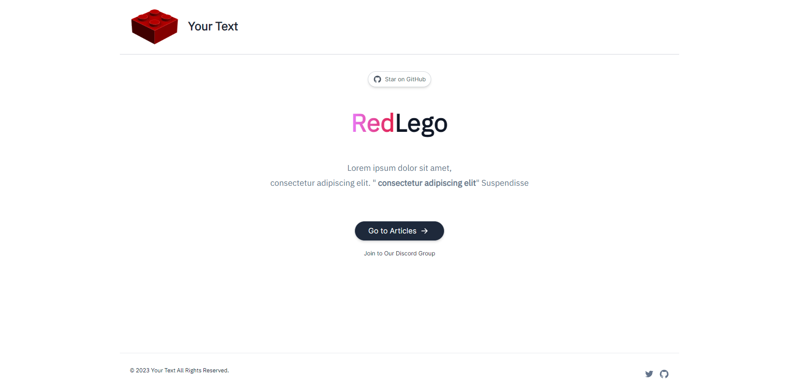

<h1 align=center>RedLego Nextjs</h1>

RedLego is a free NextJs personal blog template

<h2 align="center"> <a target="_blank" href="https://samiti.dev" rel="nofollow">Demo</a> | <a  target="_blank" href="#">Page Speed (100%)</a>
</h2>

  

